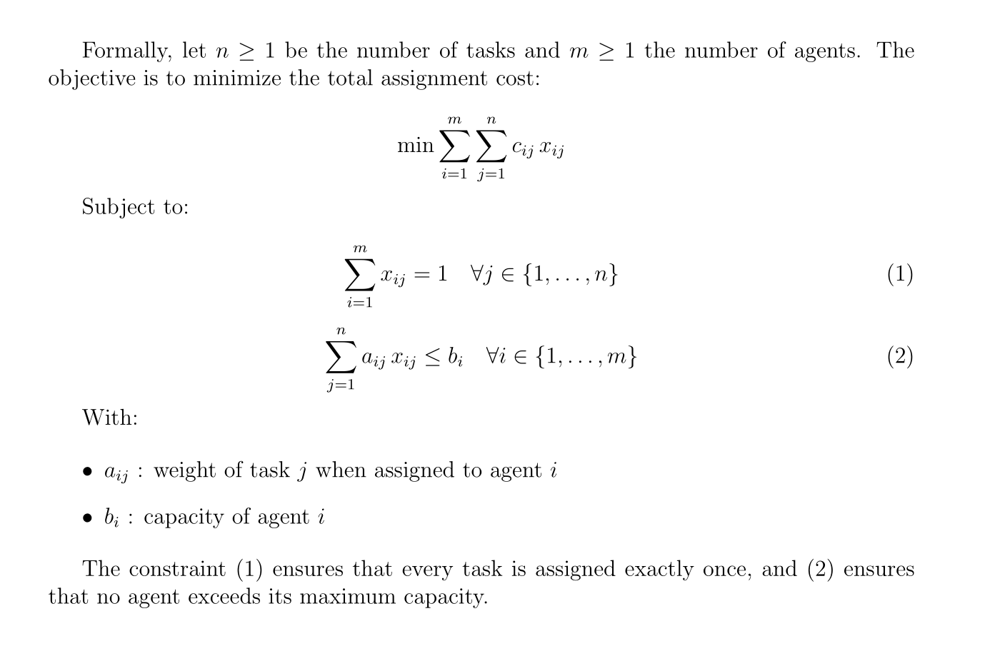
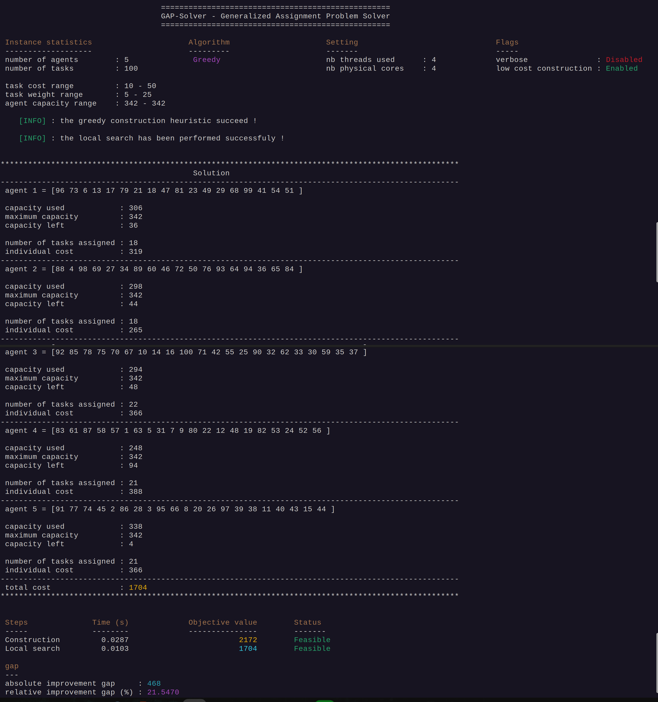
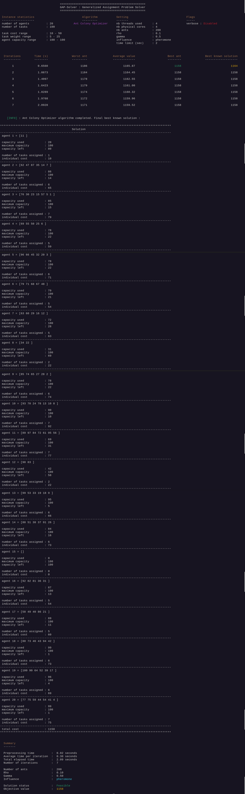
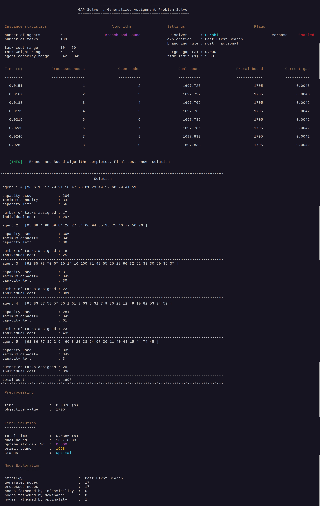

# Introduction :

The Generalized Assignment Problem (GAP) is an **NP-hard** combinatorial optimization problem that consists in assigning tasks to agents with limited capacities. 

# Mathematical Formulation




# Resolution methods

This solver implements several complementary approaches to tackle the Generalized Assignment Problem (GAP), ranging from simple constructive heuristics to advanced metaheuristics and exact methods. The goal is to provide both educational clarity and high‑performance implementations.

## 1. Greedy Construction Heuristic

Two approaches: 

- **cost‑and-weight based** (low cost construction) : builds a feasible solution by iteratively assigning tasks to agents according to a combined **cost‑and-weight** priority rule.
It generally produces **high‑quality solutions** in terms of objective value.
However, this technique may fail to construct a feasible solution on some instances, for example, the benchmark instance `benchmarks/gap_e/e20100`.

- **risky-task based** (default construction method) : always produces a feasible solution in a blink of an eye.It **prioritizes tasks that are difficult to assign**, based on their weight relative to agent capacities.This method is **robust and fast**, but the resulting solution is typically of **lower quality** compared to the **cost-and-weight based heuristic**.


## 2. Local Search (VND-like) using two neighborhoods (moves)

A local improvement procedure exploring two types of moves:

- **Balance move**: redistributes tasks from the most individually expensive agents to cheaper ones in order to reduce the global assignment cost.

- **Cheap move**: reassigns a task to a cheaper agent when feasible.

These neighborhoods yield significant improvements over the greedy constructions.
They are particularly **effective** when applied to the **risky‑task‑based** initialization : the local search **dramatically boosts the quality of these initially weaker solutions**, often bringing them on par with, or **even surpassing**, the solutions obtained from the cost‑and‑weight construction.


On the more challenging instances of **categories D and E** (benchmarks), the improvement is even more pronounced: the risky‑task‑based construction, once refined by local search, produces solutions that clearly outperform those derived from the cost‑and‑weight heuristic.

## 3. Ant Colony System (ACS) elitist strategy  with Local Search — Dorigo et al.

A metaheuristic inspired by the behavior of ants.
Artificial ants construct solutions using pheromone trails and heuristic information, enabling a balance between exploration and exploitation.
ACS is particularly effective for combinatorial problems like the GAP.

## 4. Branch and Bound

An exact method that systematically explores the search tree while pruning suboptimal regions using bounds.
This approach guarantees optimality but may become expensive for large instances due to the NP-hard nature of the problem.

## 5. High‑Performance Computing (HPC) Enhancements

To accelerate computation, the solver integrates **CPU multi‑threading** with parallel evaluation of neighborhoods, construction heuristics and pheromone updates. Multi‑threading provides a substantial speed‑up, especially on large instances where independent evaluations can be processed concurrently.


# Dependencies :


>**Note** : The solver is only designed for Linux and macOS operating systems.

### Mandatory : 

- meson (at least 1.5.1)
- ninja (at least 1.11.1)
- g++ (C++20)

### Optional :
- doxygen 

### MILP SOLVERS :

To enable the Branch and Bound algorithm or Milp backends, you must have at least one of : 

- Highs (open source)
- Hexaly (commercial, licence required)
- Gurobi (commercial, licence required)


# Installation : 

## 1. Clone the repository

```bash
git clone https://github.com/Josue-Tambwe/GeneralizedAssignmentProblem.git
```

## 2. Move into the project directory

```bash
cd GeneralizedAssignmentProblem

```

## 3. Make the installation script executable


 ```bash
 chmod +x install.sh 
```
## 4. Run the installation script

Without MILP solvers : 

```bash
./install.sh
```
___

If you have MILP solvers installed, define the environment variables pointing to their installation folders : 

- GUROBI_HOME -> for Gurobi
- HX_HOME -> for Hexaly
- Highs does not require an environment variable

### Example on Linux
```bash
# Gurobi
export GUROBI_HOME=/home/<user>/gurobi1300/linux64
export PATH="$PATH:$GUROBI_HOME/bin"
export LD_LIBRARY_PATH="$LD_LIBRARY_PATH:$GUROBI_HOME/lib"

# Hexaly
export HX_HOME=/home/<user>/hexaly_14_5
export PATH="$PATH:$HX_HOME/bin"
export LD_LIBRARY_PATH="$LD_LIBRARY_PATH:$HX_HOME/bin"
```


### Example on MacOS

```bash
# Gurobi
export GUROBI_HOME=/Library/gurobi1300/macos_universal2
export PATH="$PATH:$GUROBI_HOME/bin"
export DYLD_LIBRARY_PATH="$DYLD_LIBRARY_PATH:$GUROBI_HOME/lib"

# Hexaly
export HX_HOME=/Users/<user>/hexaly_14_5
export PATH="$PATH:$HX_HOME/bin"
export DYLD_LIBRARY_PATH="$DYLD_LIBRARY_PATH:$HX_HOME/bin"
```

You can add these lines to your `~/.bashrc` or `~/.zshrc` (depending on your shell) to make them persistent.

> **Note:** Adapt those lines to your versions installed of **Gurobi** and **Hexaly**. In addition, once the project is compiled, you can choose the MILP solver at runtime.  GAP‑Solver does not hard‑code a specific backend: the solver is selected dynamically based on the command‑line options you provide when running the executable.


Then run the installer with the backends you want to enable : 

```bash
./install.sh HAS_GUROBI HAS_HEXALY HAS_HIGHS
```
___

# Benchmark Instances

All benchmark instances used in this project come from the well‑known GAP benchmark library maintained by Yagiura et al. at Nagoya University:  
[Benchmark GAP – Yagiura et al.](http://www.al.cm.is.nagoya-u.ac.jp/~yagiura/gap/)

This dataset is widely used in the literature for evaluating heuristics, metaheuristics, and exact methods for the Generalized Assignment Problem.  
It contains several categories of instances (A, B, C, D, E), ranging from small and easy to large and highly challenging.  
In particular, instances from categories **D** and **E** are known to be difficult and are commonly used to stress‑test construction heuristics and local search procedures.


>**Note** : **All instances follow the same standardized GAP input format, and the GAP‑Solver is designed to read this format directly without any preprocessing**.


# Usage / CLI examples

The executable is located in the **bin/** directory after installation.

## 1. Move into the **bin/** directory

```bash
cd bin
```

## 2. Display the help message

```bash
./gap_solver --help
```

## 3. Run the Greedy heuristic (construction + local search)

```bash
./gap_solver --algorithm=greedy --instance=../benchmarks/gap_a/a05100 --nb-threads=4  --low-cost-construction
```

- **--nb-threads** option is optional.
If omitted, the solver automatically uses the **number of physical CPU cores**, which generally provides the best performance. You may specify any number of threads ≥ 1 depending on your hardware and preferences.

- **--low-cost-construction** option is also optional.  
When enabled, the solver uses the **cost‑and‑weight priority rule**, which typically produces **higher‑quality** initial solutions.  
However, this strategy may fail to construct a feasible solution on a few difficult benchmark instances (notably three instances from benchmark category E).  
For this reason, the default construction strategy is the **risky‑task‑based priority rule**, which always produces a feasible solution whenever one exists.




## 4. Run the Ant Colony Optimizer 
```bash
./gap_solver --algorithm=aco --instance=../benchmarks/gap_a/a20100  --time-limit=2 --nb-ants=200 
--influence=pheromone
```

- **--nb-ants** is a mandatory option. It defines the number of ants within the colony.
- **--influence** is optional. It defines the major influence when an ant is building a solution (values of **alpha** and **beta** in the ACO formalism) : 
    - balance   : equal influence of pheromones and heuristic (alpha = beta = 1)
    - heuristic : the heuristic is most influencial (alpha = 1 and beta = 2)
    - pheromone : pheromones are most influencial (alpha = 2 and beta = 1)

Additionnal options are discribed in the help message, such as : 
- **--rho** the rate of pheromones evaporation in the pheromone matrix after an iteration
- **--gamma** the rate of randomization when considering the assignment of the first task. It enables diverfied ants (solutions)
- **--iterations** defines the number of iterations to perform. An iteration consists in treating each ant within the colony (construction + local search).
- **--verbose** is a flag that enables the display of a solution when a better solution than the current best known solution is found.




## 5. Run the Branch and Bound algorithm (with greedy primal solution)

``` bash
./gap_solver --algorithm=bab --instance=../benchmarks/gap_a/a05100  --time-limit=5 --solver=gurobi 
--exploration=bfs  --branching-rule=fractional --gap=0.0
```


- **--solver**  is a required option for the linear relaxation in the B&B. Only Gurobi and Highs are used for the linear relaxation within the B&B algorithm. **Hexaly** is used for MIP resolution approch potentially with an initial solution (warm start). 
- **--exploration** is not a mandatory option. It defines the nodes exploration strategy (Best First or Depth First)
- **--branching-rule** is also optional. It defines the criteria for the branching variable (zero, one or fractional)

- **--time-limit** is not mandatory. The default value is 10 (seconds).

- **--gap** is not required. It is the target optimality gap in \[0,1\]



# References

The theoretical foundations and algorithmic components implemented in this solver are based on well‑established works in Operations Research and combinatorial optimization. Key references include:

- **Jacques Teghem** — *Recherche Opérationnelle, Tome 1*.  
  Éditions Ellipses, 2012.

- **Johann Dréo, Alain Siarry, Patrick Siarry, Patrick Siarry** — *Métaheuristiques pour l’optimisation difficile*.  
  Eyrolles, 2006.

- **Rainer Burkard, Mauro Dell’Amico, Silvano Martello** — *Assignment Problems*.  
  SIAM, 2009.  
  
